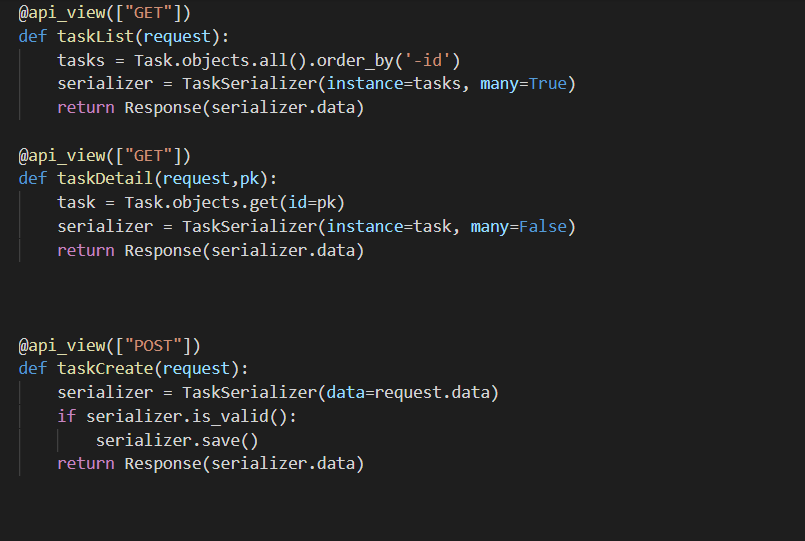
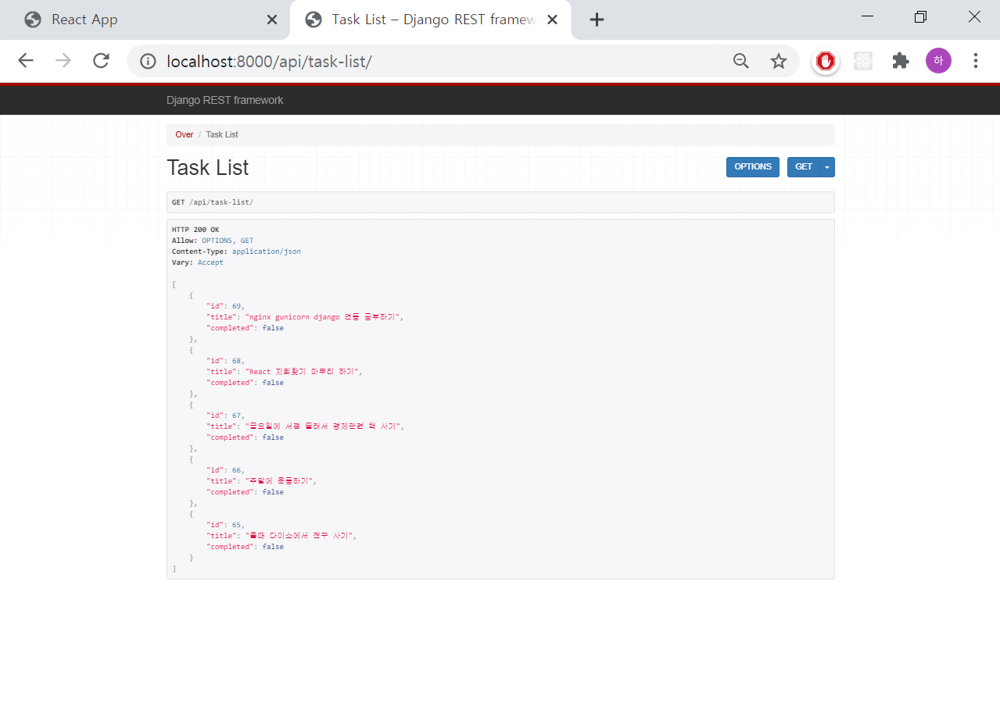
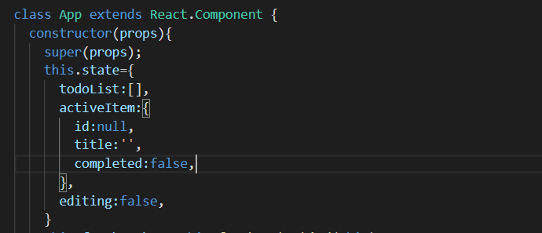
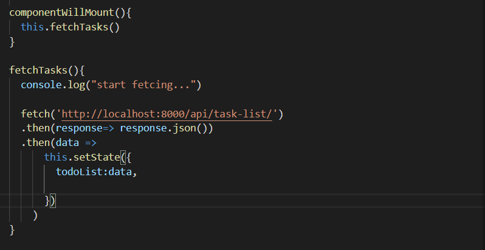
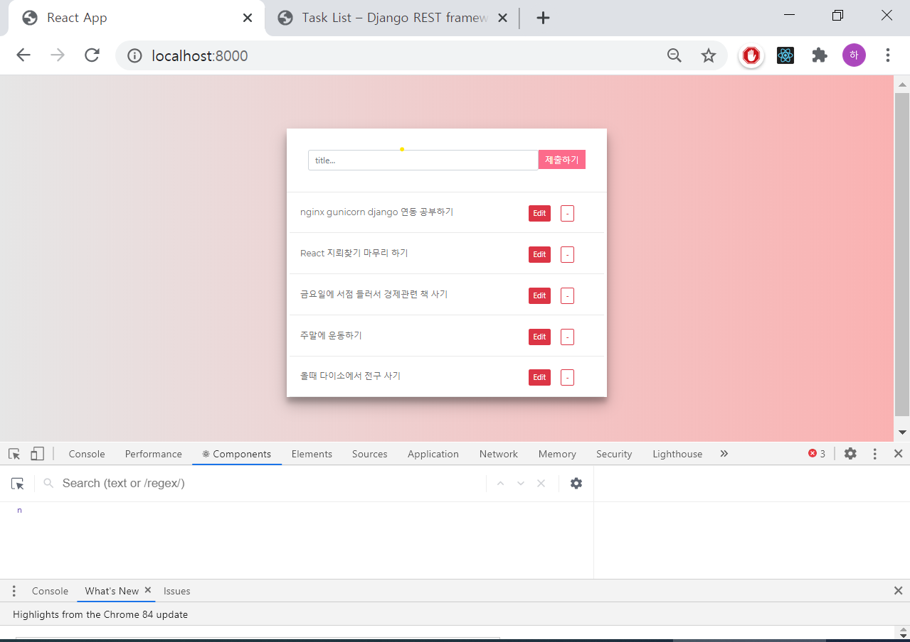
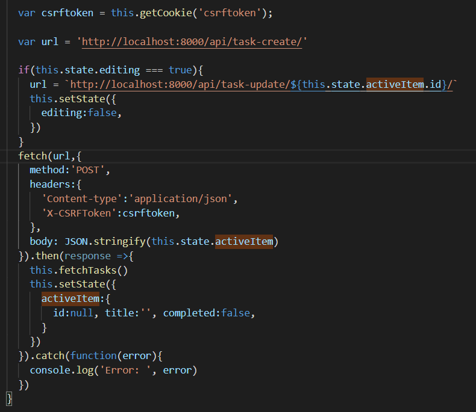

# restAPI와 React를 이용한 SPA todo리스트(http://34.64.204.254:8000)

## 필요기능
- DRF(djangorestframework)를 이용해서 restAPI서버 만들기
- frontend를 React를 이용해서 restAPI서버와 통신

----
----
## API서버 구축

restframework라이브러리의 serializer는 Form과 유사하게 생겼는데 Form과 다른점은 Form은 http에서 사용할수있는 폼을 만들어주고 serializer는 json에 사용할수있는 dict모양의 문자열을 생성해줍니다

그리고 함수기반의 뷰를 만들기 위해서 api_view 데코레이터를 import 해줬습니다   

모델에서 쿼리셋을 가져오는데 이때 serializer의 인자로 쿼리셋과 many옵션을 참으로 주고 리턴해줍니다(all이 아닌 get으로 가져온다면 옵션을 거짓으로 해줬습니다)

그런다음 urls.py에 매핑해놓은 주소로 접근하게 되면 현재 상태가 어떤지 보여주고 frontend에서 fetch통신을 통해 방금구축된 API서버와 통신할 수있는 상태가 되었습니다

----
## React로 프론트엔드 만들기
javascript는 비동기적으로 백엔드서버와 통신하고 정보를 업데이트 할수 있었지만 직접적으로 DOM에 접근한다는 위험이 있었습니다.  

그래서 지금 현재 '상태'에 따라서 지금 화면을 업데이트하는 기술이 개발되었고 그중에서 React를 선택해서 frontend를 구성하기로 했습니다

현재 state의 todoList를 만들어놓고 컴포넌트가 붙은 후에 fetch함수로 아까 뚫어놓은 API서버와 통신해서 setState로 state를 재설정 해주면 react가 변화를 스스로 감지해내고 다시 render함수를 실행하게됩니다

## 그외 CRUD

생성과 업데이트를 한번에 처리하기위해 API view단에서 폼처리와 비슷한 방식으로 기존 정보에 현재 post로 넘어온 데이터를 덮어씌우고 db에 저장하는 방식을 사용했습니다
form태그를 사용하면 jinja로 csrf-token을 날릴수있었지만 여기서는 django 공식문서에 있는 csrf-token 생성함수를 사용해서 post프로토콜로 현재 input에 내가 쓴 데이터를 JSON직렬화 해서 날렸습니다  

그 다음에 비동기 함수를 동기처럼 쓸수있는 Promise객체를 then으로 연결해서 task-list를 가져오는 fetchTasks함수를 연결해서 동기적으로 실행시켜서  

input입력 > Post프로토콜 > 완료후 새로 Get프로토콜로 list가져오기 > state변화 > 변화감지후 새로 render 흐름으로 진행되게 구성했습니다

## 어려웠던점 corseheader 인증, react input창 관리 
- restAPI와 React로 프론트/백을 나눠서 구성하게되면 장점이 굉장히 많지만 어떤 누가 restAPI에 접근해서 데이터를 받아갈지 모르게됩니다. 그래서 restAPI서버는 외부에서 확인되지않은 데이터요청이 올때 CORS에러를 일으킵니다. django-corsheaders 라이브러리를 통해 특정한 외부 데이터요청을 처리할수 있게 했습니다

- input창은 html부터 친숙하고 post데이터 처리할때도 자주 사용해서 그냥 입력한 숫자가 쳐지는게 익숙한 상황이었습니다. 상태관리 패러다임에 익숙하지 않았던 탓이었지만 그후에 지뢰찾기나, 로또추첨같이 간단한 react토이 앱을 만들면서 상태변화를 통해 input창을 관리하는게 익숙해졌습니다

## 개선할점
지금은 class형 Component를 사용하고있지만 hooks라는 함수형 Component가 나왔고 사용을 장려하는 중이기 때문에 hooks로도 새로 짤예정입니다.  
현재는 update/delete 상황에서 fetch후에 새로 전체 리스트를 새로 받아와서 의미없는 부분이 의미없이 render되고있는데 이 부분을 개선할것입니다